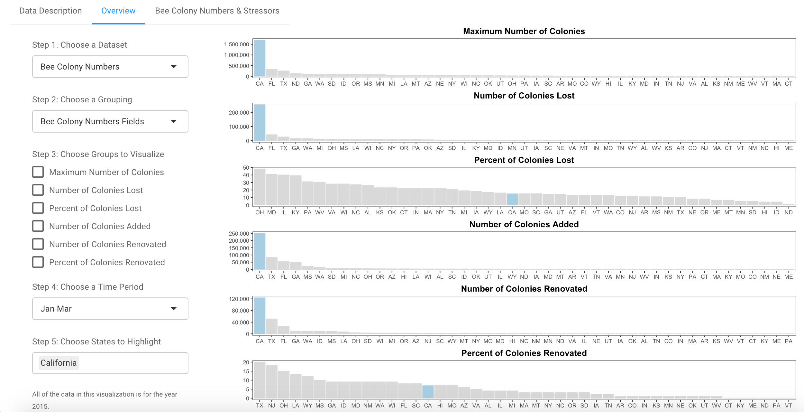
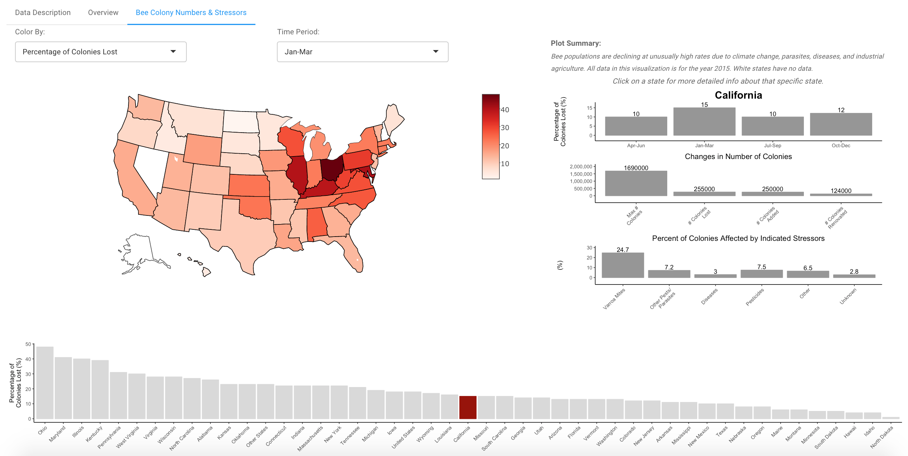

# Bee Colonies

A Study of the Pollination, Honey Production, and Risk Factors for Bees in the US

Bee populations are declining at unusually high rates. Much of this is due to climate change, parasites, diseases, and industrial agriculture. This is an alarming phenomenon as bees are essential for food production. In these visualizations, I provide insight into this phenomenon in order to help users understand this issue better.

The public data set I worked with is from the United States Department of Agriculture (USDA). The USDA collects data on stressors to bee colonies, changes in numbers of bee colonies, honey production, and pollination costs in order to help track risk factors and mortality for our nation’s main pollinators. I specifically looked at 3 csv files spanning 2015. The files analyzed consisted of numerical, categorical, as well as temporal data.

I gathered data from the following sources:
- https://www.nass.usda.gov/Surveys/Guide_to_NASS_Surveys/Bee_and_Honey/
- http://usda.mannlib.cornell.edu/MannUsda/viewDocumentInfo.do?documentID=1191
- http://usda.mannlib.cornell.edu/MannUsda/viewDocumentInfo.do?documentID=2008

The _BeeColonies-05-12-2016_, _CostPoll-12-22-2016_, and _Hone-03-22-2016_ folders all contain the original data downloaded from the listed sources above. The _clean_data_ folder contains the cleaned data. The _clean_data.R_ file cleans the original downloaded data.

## Screenshots





## Execution of Code
The code requires the following R libraries:
- shiny
- ggvis
- dplyr
- plyr
- tidyr
- reshape2
- ggplot2
- scales
- grid
- gridExtra
- RColorBrewer
- networkD3
- plotly
- shinythemes

In order to run the visualization locally, the following code can be executed in an R script.
- ```shiny::runGitHub("Data_Visualization", username = "cmchu", subdir = "Bee_Colonies")```

Note: the above required libraries must already be installed.
