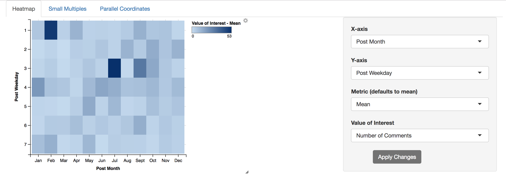

# Facebook

This R shiny app displays 3 different multivariate techniques of visualizing the Facebook dataset: heatmap, small multiples, and parallel coordinates. The main goal of this app was to learn about different multivariate visualization techniques and to practice implementing them in R shiny with a high level of interactivity. All visualizations are interactive.

Data was downloaded from the [UCI Machine Learning Repository](http://archive.ics.uci.edu/ml/datasets/Facebook+metrics).

## Screenshots




## Execution of Code
The code requires the following R libraries:
- shiny
- ggplot2
- ggvis
- dplyr
- RColorBrewer
- scales
- reshape2

In order to run the visualization locally, the following code can be executed in an R script. 
- ```shiny::runGitHub("Data_Visualization", username = "cmchu", subdir = "Facebook")```

Note: the above required libraries must already be installed.
