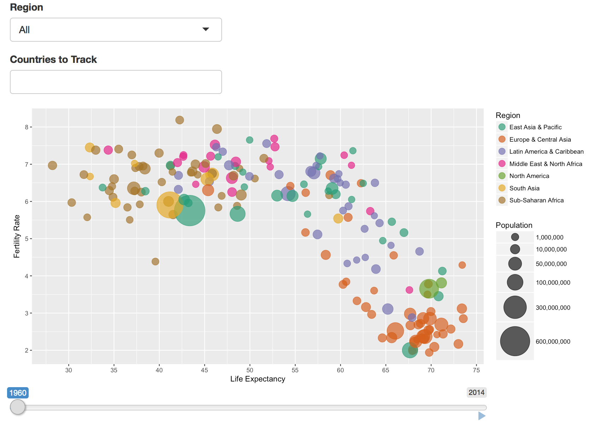

# Life Expectancy vs Fertility Rate

This bubble plot was inspired by [this similar example](https://www.google.com/publicdata/explore?ds=d5bncppjof8f9_&ctype=b&strail=false&nselm=s&met_x=sp_dyn_le00_in&scale_x=lin&ind_x=false&met_y=sp_dyn_tfrt_in&scale_y=lin&ind_y=false&met_s=sp_pop_totl&scale_s=lin&ind_s=false&dimp_c=country:region&ifdim=country&iconSize=0.5&uniSize=0.035#!ctype=b&strail=false&bcs=d&nselm=s&met_x=sp_dyn_le00_in&scale_x=lin&ind_x=false&met_y=sp_dyn_tfrt_in&scale_y=lin&ind_y=false&met_s=sp_pop_totl&scale_s=lin&ind_s=false&dimp_c=country:region&ifdim=country&pit=-307213200000&hl=en_US&dl=en_US&ind=false). This visualization was created mainly using R Shiny and ggplot2. It displays the life expectancy of countries vs their fertility rate over time. Additionally, the color of the bubbles is based on the continent the country belongs to and the size of the bubbles is based on the population size of that country. The plot is interactive, allowing users to examine a particular year, highlight a certain region, pick specific countries to track over time, and to see which bubble corresponds to which country.

## Execution of Code
The code requires the following R libraries:
- shiny
- ggplot2
- reshape2
- tidyr
- ggrepel

In order to run the visualization locally, the following code can be executed in an R script.
- shiny::runGitHub("Data_Visualization", username = "cmchu", subdir = "Life_Expectancy_vs_Fertility_Rate/app.R")

Note: the above required libraries must already be installed.
